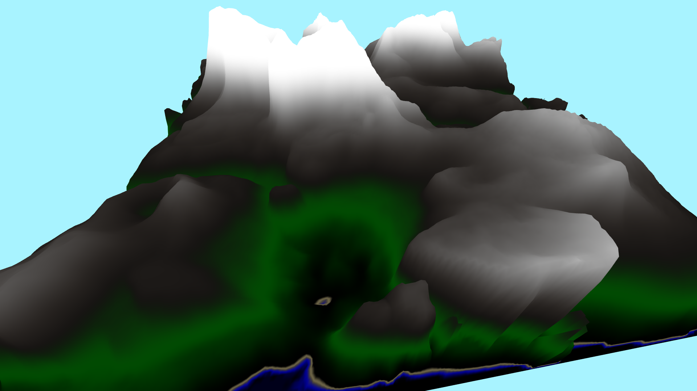
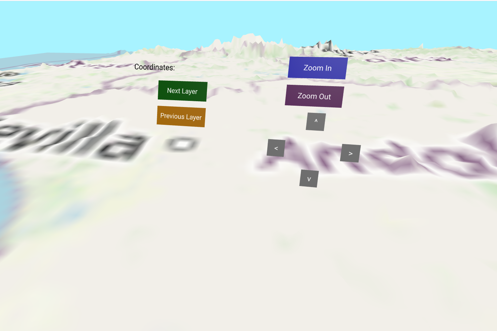
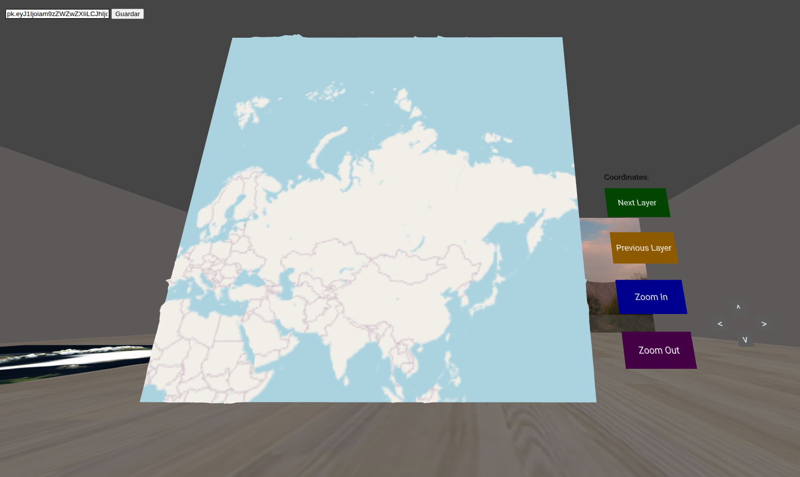
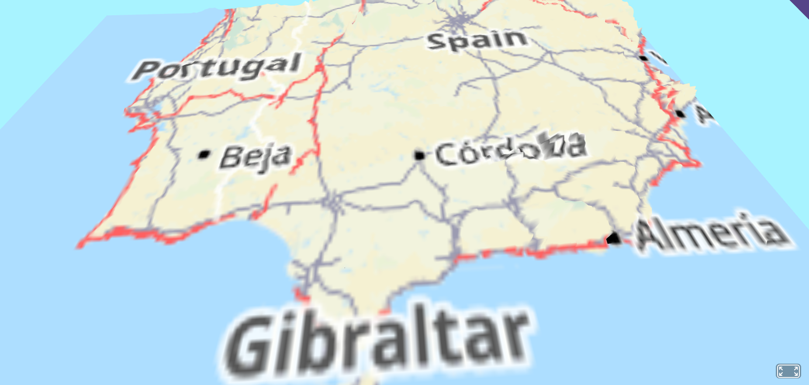
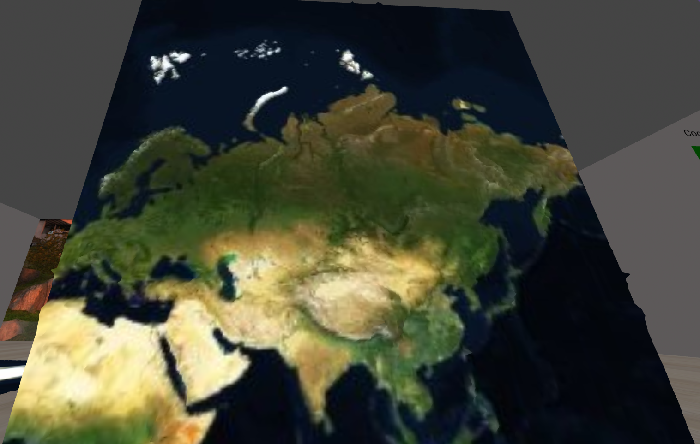
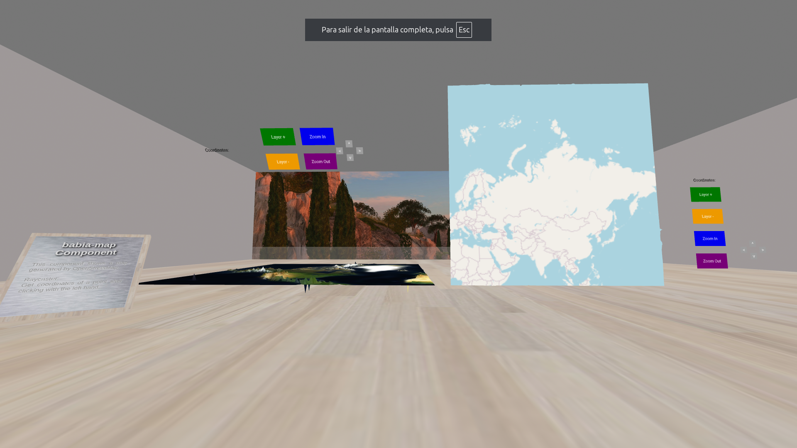
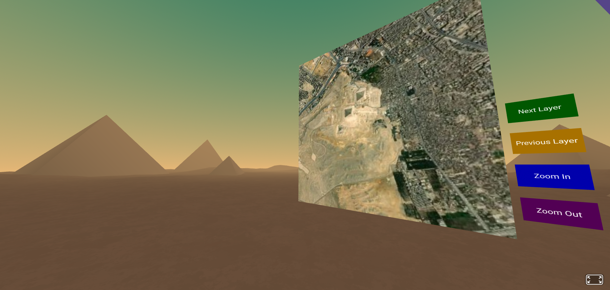

# Terrain Generation in `babiaxr` with Three.js and Heightmaps

The `babiaxr` component enables the rendering of three-dimensional terrains based on real-world elevation data, integrating technologies such as *Three.js*, *A-Frame*, and mapping services like Mapbox. This document describes the terrain generation process using heightmaps, the key configuration properties, and the use of custom shading to enhance visual realism.

## Technical Requirements

The environment required to use this feature includes:

- **Node.js v21.7.1**, managed through NVM or another compatible system.
- A **free Mapbox API token**, needed to access elevation images and textures. You can obtain this token at [https://www.mapbox.com](https://www.mapbox.com).
- A browser compatible with *WebGL 2.0*, required for smooth graphical rendering.

## 🔐 Using the Mapbox Token

The `babia-map` component requires a **valid access token** for the Mapbox API to download elevation tiles (`mapbox.terrain-rgb`). This token is entered manually through an HTML form and saved in the browser using `localStorage`.

---

### 📄 Step 1: Create your token in Mapbox

1. Go to [https://account.mapbox.com/access-tokens/](https://account.mapbox.com/access-tokens/)
2. Create a new token with permissions for `mapbox.terrain-rgb`
3. Copy that token

---

### 💡 Step 2: Add the HTML Form

The component expects a form with ID `#token-form` and an input field with ID `#token-input`. This form must be included in your HTML file:

```html
<form id="token-form">
  <label for="token-input">Token de Mapbox:</label>
  <input type="text" id="token-input" placeholder="Introduce tu token" />
  <button type="submit">Guardar token</button>
</form>
```

### ⚙️ What does this form do?

When the page loads:

- If a token is saved in *localStorage*, it is automatically loaded into the input and used to generate the map.

When you enter a new token and submit:

- The token is saved in *localStorage* under the key *babia-map-token*
- The component’s token property is updated
- The terrain is rebuilt (`buildMesh(...)`) using the new token

>⚠️ If you don’t enter a valid token or the form is not present in the DOM, the map will not generate correctly and a *console.warn* will appear.

### 🧪 Development Tips

Make sure the form loads before initializing the component.

You can check if the token was saved by inspecting *localStorage* in the browser’s developer tools.

## Introduction to *Three.js* in the A-Frame Context

*A-Frame* is a framework focused on developing web-based virtual reality experiences. Internally, it relies on *Three.js*, a 3D graphics library that provides detailed control over scenes, cameras, lights, geometries, and materials.

Although A-Frame abstracts many of these features, `babiaxr` directly accesses the *Three.js* API to manipulate terrain geometry more precisely.

## Heightmaps

Heightmaps are grayscale images where lighter tones indicate higher elevations and darker tones represent depressions. When applied to a flat geometry, these maps allow for surface deformation to simulate natural terrain.

In *Three.js*, this deformation is done by displacing the plane’s vertices based on the intensity of each heightmap pixel.



## Key Properties for Terrain Generation

To properly configure terrain relief, the following *Three.js* properties are used:

- `displacementMap` or `bumpMap`: a texture containing the heightmap, usually in `.png` format.
- `displacementScale` or `bumpScale`: value that determines the vertical deformation intensity based on grayscale values.
- `width` and `height`: physical dimensions of the base plane to which the heightmap is applied.

These properties can be dynamically adjusted to change the terrain’s appearance without reloading the scene.

### Map Properties

| Property         | Type    | Default Value     | Description                                                                 |
| ---------------- | ------- | ----------------- | --------------------------------------------------------------------------- |
| `width`          | number  | 1000              | Width of the terrain in Three.js units.                                     |
| `height`         | number  | 1000              | Height of the terrain in Three.js units.                                    |
| `horTexture`     | number  | 2                 | Horizontal repetitions of the texture.                                      |
| `vertTexture`    | number  | 2                 | Vertical repetitions of the texture.                                        |
| `widthSegments`  | int     | 200               | Number of horizontal subdivisions of the plane.                             |
| `heightSegments` | int     | 200               | Number of vertical subdivisions of the plane.                               |
| `bumpScale`      | number  | 300               | Vertical deformation scale based on the elevation map.                      |
| `wireframe`      | boolean | false             | If `true`, displays the terrain in wireframe mode.                          |
| `token`          | string  | —                 | Authentication token for the Mapbox APIs.                                   |
| `zoom`           | number  | 4                 | Zoom level of the tiles (affects quality and size).                         |
| `x`              | number  | 0                 | X coordinate of the tile to load.                                           |
| `y`              | number  | 0                 | Y coordinate of the tile to load.                                           |
| `subdomain`      | string  | `"a"`             | Subdomain used for services like Thunderforest (options: a, b, c).          |
| `textureType`    | string  | `"Standard"`      | Type of texture to apply. Options: `"Coloured"`, `"Standard"`, `"Satellite"`, `"Hot"`, `"Cycle"`, `"Transport"`. |

### Component Functionality

#### Defined Shaders

The component uses two shader combinations:

- *vertexShader2* and *fragmentShader2*: For external textures (OSM, satellite, HOT, etc.).
- *vertexShader1* and *fragmentShader1*: (Not included here) Used if `textureType === "Coloured"` to apply custom colorization based on elevation.

**vertexShader2**:

- Extracts elevation from the red channel of the *bumpTexture* map.
- Modifies vertex positions by multiplying the elevation value by *bumpScale*.

```glsl
vAmount = bumpData.r; // Elevation
vec3 newPosition = position + normal * bumpScale * vAmount;
```
#### fragmentShader2:

- Displays the original color of the *mapTexture* as the terrain texture.

### Loading the elevation map (displacement map)

A URL is constructed to Mapbox Terrain-RGB using the provided parameters (*x*, *y*, *zoom*, *token*). This image contains elevation data encoded in the red channel.

```js
let urlMapbox = `https://api.mapbox.com/v4/mapbox.terrain-rgb/${data.zoom}/${data.x}/${data.y}@2x.pngraw?access_token=${data.token}`
```

It is loaded as a texture and configured to repeat horizontally and vertically according to *horTexture* and *vertTexture*.



### Surface Texture Selection
Depending on the value of *textureType*, a texture source is selected:

| `textureType` | Texture used                                                        |
| ------------- | ------------------------------------------------------------------- |
| `"Standard"`  | Classic OpenStreetMap                                               |
| `"Satellite"` | Mapbox satellite imagery                                            |
| `"Hot"`       | Humanitarian OSM Team                                               |
| `"Cycle"`     | OpenCycleMap                                                        |
| `"Transport"` | Thunderforest Transport                                             |
| `"Coloured"`  | Custom color shader (requires custom shaders)                       |

The texture is loaded using *THREE.TextureLoader* and passed to the shader as *mapTexture*.

### Material Construction
The *ShaderMaterial* is configured with:

- *bumpTexture*: elevation map.
- *mapTexture*: terrain texture.
- *bumpScale*: vertical displacement scale.

### Terrain Generation
A *PlaneGeometry* is created with the defined size and subdivisions:

```js
const groundGeo = new THREE.PlaneGeometry(
  data.width,
  data.height,
  data.widthSegments,
  data.heightSegments
);
```

Then, rotation is applied to make it horizontal (`rotation.x = -Math.PI / 2`) and it is added to the scene as a 3D object:

```js
el.setObject3D("mesh", groundMesh);
```



### Error Handling
If the elevation map cannot be loaded, an error is thrown in the console:

```js
(error) => {
  console.error("Error al cargar el displacement map:", error);
}
```

### Example of use

```html
<a-entity
  babiaxr-terrain="width: 1000;
                   height: 1000;
                   bumpScale: 300;
                   token: YOUR_MAPBOX_TOKEN;
                   zoom: 7;
                   x: 65;
                   y: 42;
                   textureType: Satellite;">
</a-entity>
```



## Color Application Using Shaders

The application of height maps provides geometry but does not include visual information such as color or texture. To enrich the result, **custom shaders** are used, which allow assigning colors based on parameters like altitude, slope, or orientation.

With this technique, it is possible to represent snow on peaks, vegetation in middle zones, and rock in steep areas, contributing to a more realistic visual experience.

The visual appearance of the terrain in `babiaxr` is enhanced through the use of custom shaders written in GLSL. These allow defining specific colors based on the relative altitude of each point on the terrain, providing an intuitive visual classification in areas such as water, sand, vegetation, rock, and snow.

Below are descriptions of the two shaders used: the vertex shader for geometric displacement and the fragment shader for color application.

### Vertex Shader

The vertex shader modifies the position of the plane's vertices based on the height map. It uses a displacement map (`bumpTexture`) to obtain the relative height of each point and applies a scale (`bumpScale`) to displace the vertex along the plane's normal.

```glsl
uniform sampler2D bumpTexture;
uniform float bumpScale;
varying float vAmount;

void main() {
    vec4 bumpData = texture2D(bumpTexture, uv);
    vAmount = bumpData.r;
    vec3 newPosition = position + normal * bumpScale * vAmount;
    gl_Position = projectionMatrix * modelViewMatrix * vec4(newPosition, 1.0);
}
```

### Fragment Shader

The fragment shader applies colors based on the value of *vAmount* (the relative height), interpolating shades corresponding to different terrain types:

- **Water**: dark blue tone (`vec3(0.0, 0.0, 1.0)`)
- **Sand**: beige tone (`vec3(0.76, 0.7, 0.5)`)
- **Grass**: green tone (`vec3(0.0, 0.6, 0.01)`)
- **Rock**: grayish brown tone (`vec3(0.28, 0.25, 0.23)`)
- **Snow**: pure white (`vec3(1.0, 1.0, 1.0)`)

The fragment shader code is as follows:

```glsl
uniform float minHeight;
uniform float maxHeight;
varying float vAmount;

void main() {
    float totalHeight = maxHeight - minHeight;
    float maxWater = minHeight + totalHeight * 0.55;
    float minSand  = minHeight + totalHeight * 0.54;
    float maxSand  = minHeight + totalHeight * 0.57;
    float minGrass = minHeight + totalHeight * 0.56;
    float maxGrass = minHeight + totalHeight * 0.70;
    float minRock  = minHeight + totalHeight * 0.60;
    float maxRock  = minHeight + totalHeight * 0.80;
    float minSnow  = minHeight + totalHeight * 0.65;

    vec3 water = (smoothstep(0.00, maxWater, vAmount) - smoothstep(minSand, maxWater, vAmount)) * vec3(0.0, 0.0, 1.0);
    vec3 sand  = (smoothstep(minSand, maxSand, vAmount) - smoothstep(minGrass, maxSand, vAmount)) * vec3(0.76, 0.7, 0.5);
    vec3 grass = (smoothstep(minGrass, maxGrass, vAmount) - smoothstep(minRock, maxGrass, vAmount)) * vec3(0.0, 0.6, 0.01);
    vec3 rock  = (smoothstep(minRock, maxRock, vAmount) - smoothstep(minSnow, maxRock, vAmount)) * vec3(0.28, 0.25, 0.23);
    vec3 snow  = (smoothstep(minSnow, 1.0, vAmount)) * vec3(1.0, 1.0, 1.0);

    gl_FragColor = vec4(water + sand + grass + rock + snow, 1.0);
}
```
This approach provides a rich, efficient, and consistent visual representation with the actual terrain altitude, producing an aesthetic inspired by topographic maps and professional geographic visualizations.


## Recommended Resources

The following resources offer practical and detailed information on terrain generation with *Three.js*:

1. [How to Create Terrain in Three.js - YouTube](https://www.youtube.com/watch?v=wULUAhckH9w)
2. [Three.js Terrain Tutorial - YouTube](https://www.youtube.com/watch?v=G0hWjD0n46c)

---

## Relief Generation Using Elevation Data

To represent the relief of a geographic tile, an RGB-encoded image provided by the Mapbox API is used, specifically from the `mapbox.terrain-rgb` tileset. Each pixel of this image contains encoded information about the terrain altitude, which is converted to a normalized scale between 0 and 1 for later use as a displacement texture in Three.js.

### Data Source

Elevation data is obtained via the following Mapbox URL:

https://api.mapbox.com/v4/mapbox.terrain-rgb/{zoom}/{x}/{y}{@2x}.pngraw?access_token=YOUR_MAPBOX_ACCESS_TOKEN


- `{zoom}`, `{x}`, `{y}`: tile coordinates in *Slippy Map* format.
- `@2x` (optional): allows fetching 512×512 pixel images instead of the default 256×256, reducing the total number of requests.
- The tile format follows the convention described in [Slippy map tilenames (OpenStreetMap)](https://wiki.openstreetmap.org/wiki/Slippy_map_tilenames).
- Official documentation of Mapbox raster tiles can be found at [Mapbox Raster Tiles API](https://docs.mapbox.com/api/maps/raster-tiles/).

### Conversion from RGB Image to Elevation Texture



The downloaded image is transformed into a single-channel displacement texture (`THREE.DataTexture`) using the following procedure:

```js
async function loadDisplacementMap(url) {
  let img = new Image();
  img.src = url;
  img.crossOrigin = "Anonymous";

  return new Promise((resolve, reject) => {
    img.onload = () => {
      const canvas = document.createElement("canvas");
      canvas.width = img.width;
      canvas.height = img.height;
      const ctx = canvas.getContext("2d");

      // Invertir verticalmente la imagen para coincidir con la orientación de WebGL
      ctx.translate(0, canvas.height);
      ctx.scale(1, -1);
      ctx.drawImage(img, 0, 0);
      const imageData = ctx.getImageData(0, 0, img.width, img.height);
      const data = imageData.data;

      const displacement = new Float32Array(img.width * img.height);
      let elevation;
      let auxMinHeight = 1;
      let auxMaxHeight = 0;

      for (let i = 0; i < data.length; i += 4) {
        const R = data[i];
        const G = data[i + 1];
        const B = data[i + 2];

        // Conversión según la especificación de Mapbox terrain-RGB
        elevation = (R * 256 * 256 + G * 256 + B) * 0.1 - 10000;

        // Normalización para valores entre 0 y 1
        elevation = (elevation + 10000) / 20000;

        if (elevation < auxMinHeight) auxMinHeight = elevation;
        if (elevation > auxMaxHeight) auxMaxHeight = elevation;

        displacement[i / 4] = elevation;
      }

      minHeight = auxMinHeight;
      maxHeight = auxMaxHeight;

      const texture = new THREE.DataTexture(
        displacement,
        img.width,
        img.height,
        THREE.RedFormat,
        THREE.FloatType
      );

      texture.needsUpdate = true;
      resolve(texture);
    };
    img.onerror = reject;
  });
}
```



All code related to map generation is wrapped in a `buildMesh(...)` function whose usage is involved both in initialization and updating. For example:

```js
update: function (oldData) {
    const data = this.data;
    const el = this.el;

    if (data.token !== oldData.token || data.textureType !== oldData.textureType) {
      el.removeObject3D("mesh");
      this.buildMesh(data, el);
    }
  },
```
# Using the component

The **babiaxr** component allows you to incorporate an interactive interface over the map, composed of different buttons distributed around the user in VR mode or integrated into the 3D environment. These buttons enable actions such as zooming, changing layers, and moving the map.



## Properties for customization
The interface is fully parameterized through component properties that can be modified in HTML or via JavaScript. Each property is described below:

### General positioning of button groups

- **entityRightButton**: position and rotation of the right-side button group.
- **entityLeftButton**: position and rotation of the left-side button group.
- **crossEntity**: position and rotation of the directional button group (d-pad).
- **coordinates**: stores the current coordinates pointed by the left hand (in VR mode).
- **handsUi**: enables or disables the use of buttons attached to the hands in VR (true by default).

### Specific buttons

Each of the following groups accepts a serialized array (string with *JSON.stringify*) of objects with the following structure:

```js
{
  height: "0.075",         // Altura del botón
  width: "0.2",            // Anchura
  label: "Zoom In",        // Texto visible
  color: "blue",           // Color por defecto
  position: "0 0.15 -0.3", // Posición local respecto al grupo
  rotation: "0 0 0",       // Rotación
  textSize: 0.6,           // Tamaño de la fuente
  className: "zoomInBtn"   // Clase usada para manejar eventos
}
```

| Property          | Type and Default Value                                                                                             | Description / Explanation                                                                                           |
|-------------------|-------------------------------------------------------------------------------------------------------------------|--------------------------------------------------------------------------------------------------------------------|
| `coordinates`     | `vec2`                                                                                                            | Current coordinates pointed by the left hand in VR.                                                                |
| `handsUi`         | `boolean` (default: `true`)                                                                                       | Enables or disables the button interface attached to the hands in VR to facilitate interaction.                    |
| `entityRightButton` | `string` (JSON with position `'0.25 201.5 -0.5'` and rotation `'-30 0 0'`)                                        | Defines the position and rotation of the button group appearing to the user's right.                                |
| `entityLeftButton`  | `string` (JSON with position `'-0.25 201.5 -0.5'` and rotation `'-30 0 0'`)                                       | Defines the position and rotation of the button group appearing to the user's left.                                 |
| `rightButtons`    | `string` (JSON array with buttons for zoom, e.g., "Zoom In" and "Zoom Out")                                        | Configures the buttons shown on the right side, typically for zoom actions.                                        |
| `crossEntity`     | `string` (JSON with position `"0 -0.15 -0.25"` and rotation `"0 0 0"`)                                            | Defines the position and rotation of the d-pad type button group for directional movements.                         |
| `crossButtons`    | `string` (JSON array with directional buttons "^", "v", "<", ">")                                                  | Configures the d-pad buttons that allow moving the map up, down, left, and right.                                  |
| `leftButtons`     | `string` (JSON array with buttons for layers, e.g., "Next Layer" and "Previous Layer")                             | Configures the buttons shown on the left side to navigate between map layers or levels.                             |
| `coordinatesText` | `string` (JSON with label "Coordinates:", color, position, and text size)                                          | Defines the text showing the current coordinates on the map, with customizable style and position.                  |

Available groups are:

- **rightButtons**: typically for actions like zoom.
- **leftButtons**: layer navigation.
- **crossButtons**: movement in four directions.
- **coordinatesText**: text field displaying coordinates.

### Example configuration (in HTML)

```html
<a-entity class="collidable" babia-map="height: 8; width: 8; bumpScale: 1; zoom: 1; textureType: Satellite; handsUi: false;

    entityRightButton: {&quot;position&quot;:&quot;0.6 4 3&quot;, &quot;rotation&quot;:&quot;30 0 0&quot;};
    entityLeftButton: {&quot;position&quot;:&quot;-0.6 4 3&quot;, &quot;rotation&quot;:&quot;30 0 0&quot;};

    rightButtons: [
    {&quot;height&quot;:&quot;0.5&quot;, &quot;width&quot;:&quot;1&quot;, &quot;label&quot;:&quot;Zoom In&quot;, &quot;color&quot;:&quot;blue&quot;, &quot;position&quot;:&quot;0 0.75 -0.3&quot;, &quot;rotation&quot;:&quot;0 0 0&quot;, &quot;textSize&quot;:3, &quot;className&quot;:&quot;zoomInBtn&quot;},
    {&quot;height&quot;:&quot;0.5&quot;, &quot;width&quot;:&quot;1&quot;, &quot;label&quot;:&quot;Zoom Out&quot;, &quot;color&quot;:&quot;purple&quot;, &quot;position&quot;:&quot;0 0 -0.3&quot;, &quot;rotation&quot;:&quot;0 0 0&quot;, &quot;textSize&quot;:3, &quot;className&quot;:&quot;zoomOutBtn&quot;}
    ];

    crossEntity: {&quot;position&quot;:&quot;1 0.375 0&quot;, &quot;rotation&quot;:&quot;0 0 0&quot;};
    crossButtons: [
    {&quot;height&quot;:&quot;0.2&quot;, &quot;width&quot;:&quot;0.2&quot;, &quot;label&quot;:&quot;^&quot;, &quot;color&quot;:&quot;darkgray&quot;, &quot;position&quot;:&quot;0 0.2 0&quot;, &quot;textSize&quot;:3, &quot;className&quot;:&quot;dpadUp&quot;},
    {&quot;height&quot;:&quot;0.2&quot;, &quot;width&quot;:&quot;0.2&quot;, &quot;label&quot;:&quot;v&quot;, &quot;color&quot;:&quot;darkgray&quot;, &quot;position&quot;:&quot;0 -0.2 0&quot;, &quot;textSize&quot;:3, &quot;className&quot;:&quot;dpadDown&quot;},
    {&quot;height&quot;:&quot;0.2&quot;, &quot;width&quot;:&quot;0.2&quot;, &quot;label&quot;:&quot;&lt;&quot;, &quot;color&quot;:&quot;darkgray&quot;, &quot;position&quot;:&quot;-0.3 0 0&quot;, &quot;textSize&quot;:3, &quot;className&quot;:&quot;dpadLeft&quot;},
    {&quot;height&quot;:&quot;0.2&quot;, &quot;width&quot;:&quot;0.2&quot;, &quot;label&quot;:&quot;&gt;&quot;, &quot;color&quot;:&quot;darkgray&quot;, &quot;position&quot;:&quot;0.3 0 0&quot;, &quot;textSize&quot;:3, &quot;className&quot;:&quot;dpadRight&quot;}
    ];

    leftButtons: [
    {&quot;height&quot;:&quot;0.5&quot;, &quot;width&quot;:&quot;1&quot;, &quot;label&quot;:&quot;Next Layer&quot;, &quot;color&quot;:&quot;green&quot;, &quot;position&quot;:&quot;0 0.75 -0.3&quot;, &quot;rotation&quot;:&quot;0 0 0&quot;, &quot;textSize&quot;:3, &quot;className&quot;:&quot;layerUpBtn&quot;},
    {&quot;height&quot;:&quot;0.5&quot;, &quot;width&quot;:&quot;1&quot;, &quot;label&quot;:&quot;Previous Layer&quot;, &quot;color&quot;:&quot;orange&quot;, &quot;position&quot;:&quot;0 0 -0.3&quot;, &quot;rotation&quot;:&quot;0 0 0&quot;, &quot;textSize&quot;:3, &quot;className&quot;:&quot;layerDownBtn&quot;}
    ];

    coordinatesText: {&quot;label&quot;:&quot;Coordinates: &quot;,&quot;color&quot;:&quot;black&quot;,&quot;position&quot;:&quot;-0.5 1.2 -0.4&quot;,&quot;rotation&quot;:&quot;0 0 0&quot;,&quot;textSize&quot;:3};
" position="-6 -5 -6">
```

## Internal Functioning and Events

The buttons use standard A-Frame events such as *click*, *mouseenter*, and *mouseleave* to change color when hovered over or to perform an action. Some classes and their associated functions are:

| CSS Class      | Action Executed          |
| -------------- | ------------------------ |
| `zoomInBtn`    | Increases the map zoom   |
| `zoomOutBtn`   | Decreases the zoom       |
| `layerUpBtn`   | Next layer               |
| `layerDownBtn` | Previous layer           |
| `dpadUp`       | Move up                  |
| `dpadDown`     | Move down                |
| `dpadLeft`     | Move left                |
| `dpadRight`    | Move right               |

The button color automatically changes to **yellow** on hover (*mouseenter*) and returns to its original color on exit (*mouseleave*), which is determined by its class.

## VR and Hand Controls Compatibility

If *handsUi* is enabled, the component automatically looks for entities with hand controls (*#leftHand*, *#rightHand*, *[laser-controls][hand=...]*, etc.) to add the buttons directly to the hands, using helper functions:

```js
findHandEntity('left');
findHandEntity('right');
```

This behavior ensures that the buttons are always visible and accessible in VR, without the need to move the head or body.

## Interaction with the Map Using the Left Hand

The user can tap the map with the left hand to obtain the geographic coordinates (latitude and longitude) of the touched point. Additionally, a **red sphere** is visually generated at the last tapped point, acting as a marker.

This functionality is based on converting the local coordinates of the tapped point in 3D space to geographic coordinates using the Web Mercator projection, compatible with OpenStreetMap (OSM).

**Technical details**:

- The local click position relative to the map is calculated.
- This position is transformed to global tile coordinates and then to latitude/longitude.
- The `coordinates` attribute of the `babia-map` component is updated with the geographic values.
- A red marker (sphere) is created or moved to the tapped position.
- The visible texts in the UI are updated to show the current coordinates.
- If the `handsUi` property is active, the coordinate text is also shown on the left-hand interface.

| Functionality               | Description                                                                                                   | Explanation                                                                                                                                                        |
|----------------------------|---------------------------------------------------------------------------------------------------------------|------------------------------------------------------------------------------------------------------------------------------------------------------------------|
| Tap with left hand          | Allows tapping the map to get geographic coordinates and generate a visual marker at the tapped point.        | Converts the tapped local position to lat/lon using the Web Mercator projection. Updates the `coordinates` attribute, creates/moves a red sphere at the tapped position, and updates the coordinate text in the UI. |

### Calculating lat/lon coordinates from the map’s local coordinates

The following code shows how local coordinates (in the 3D map space) are converted to geographic latitude and longitude using the OpenStreetMap Slippy Map Tilenames formula:

```js
function localCoordsToLatLon(localX, localZ, el) {
  const zoom = el.getAttribute('babia-map').zoom;   // Zoom actual del mapa
  const tileX = el.getAttribute('babia-map').x;      // Coordenada X de la tesela (tile)
  const tileY = el.getAttribute('babia-map').y;      // Coordenada Y de la tesela (tile)
  const width = el.getAttribute('babia-map').width;  // Ancho del mapa en unidades locales
  const height = el.getAttribute('babia-map').height;// Alto del mapa en unidades locales

  // Convertimos coordenadas locales en rango [0, 1]
  const u = (localX + width / 2) / width;
  const v = 1 - (localZ + height / 2) / height;

  // Calculamos posición global en teselas (decimales)
  const n = Math.pow(2, zoom);
  const globalTileX = tileX + u;
  const globalTileY = tileY + v;

  // Conversión a longitud en grados
  const lon = globalTileX / n * 360 - 180;

  // Conversión a latitud en grados usando la fórmula Web Mercator
  const latRad = Math.atan(Math.sinh(Math.PI * (1 - 2 * globalTileY / n)));
  const lat = latRad * (180 / Math.PI);

  return { lat, lon };
}
```

This method follows the specifications of [Slippy Map Tilenames](https://wiki.openstreetmap.org/wiki/Slippy_map_tilenames), where:

- **zoom** is the current zoom level.
- **(tileX, tileY)** is the tile coordinate in the global grid.
- **(localX, localZ)** are the local coordinates within the map.
- **u** and **v** normalize those coordinates to the range [0,1].
- **lon** and **lat** return the resulting geographic coordinates.
